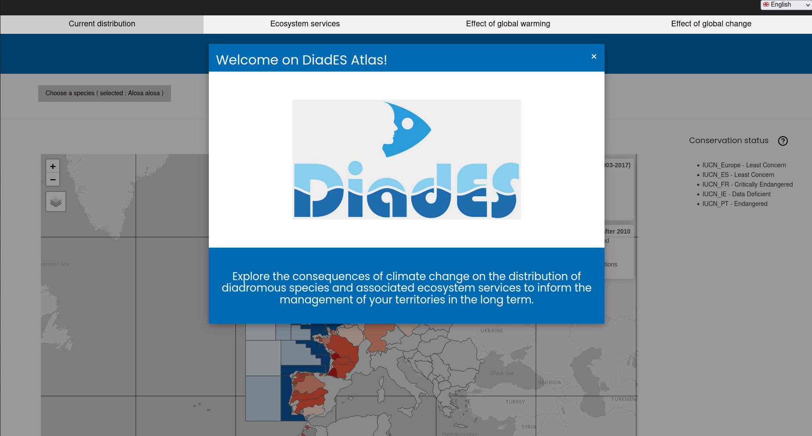
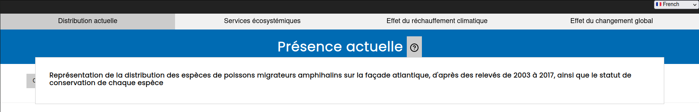
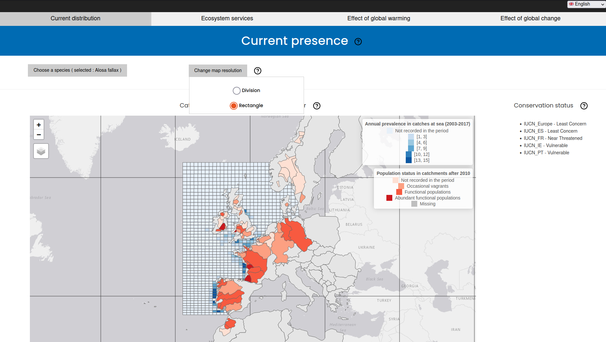
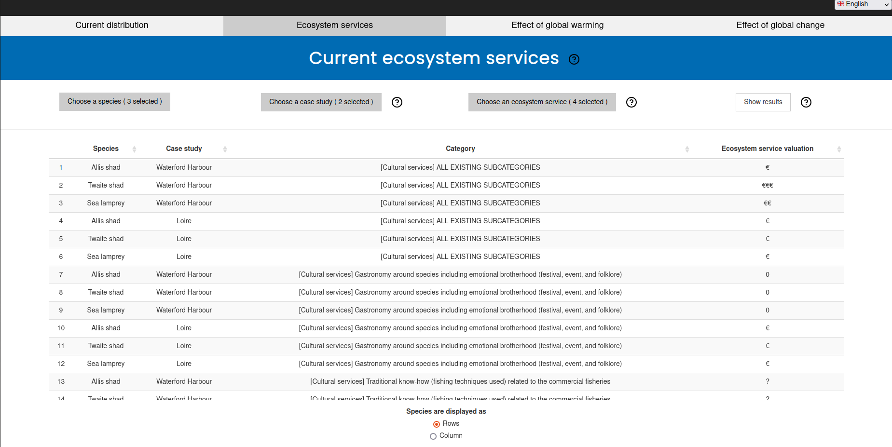
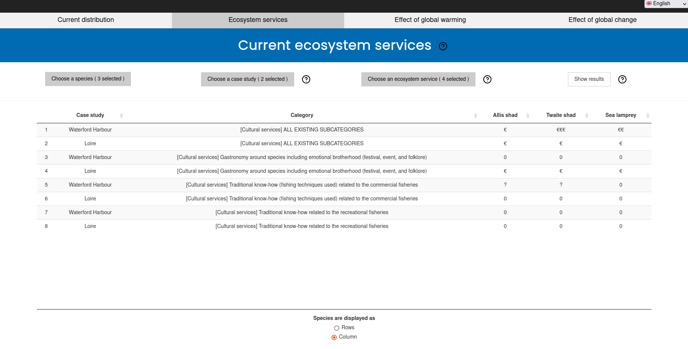
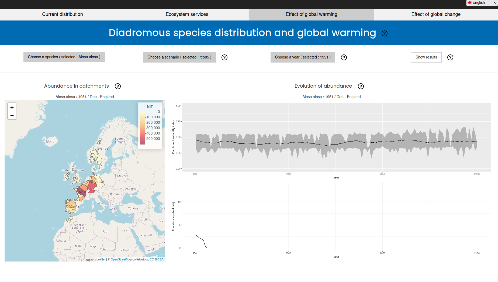
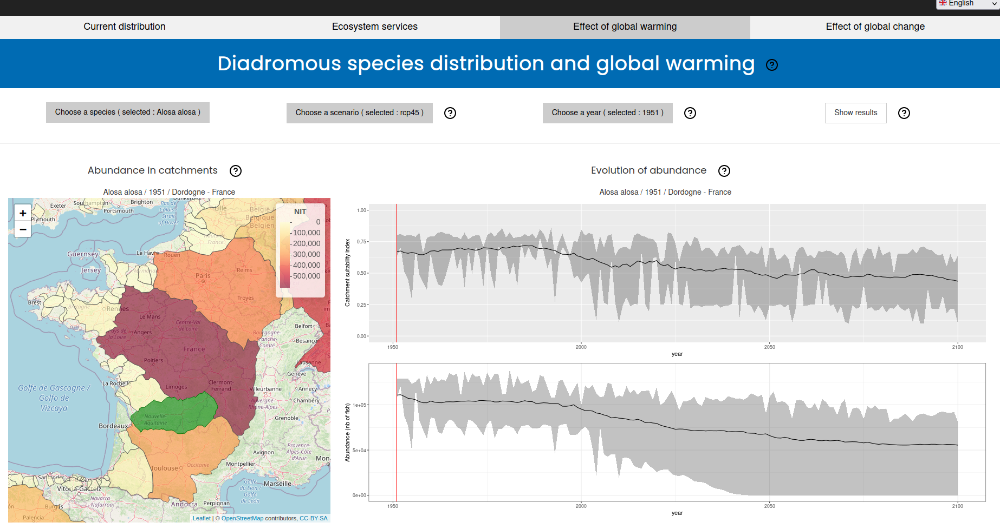
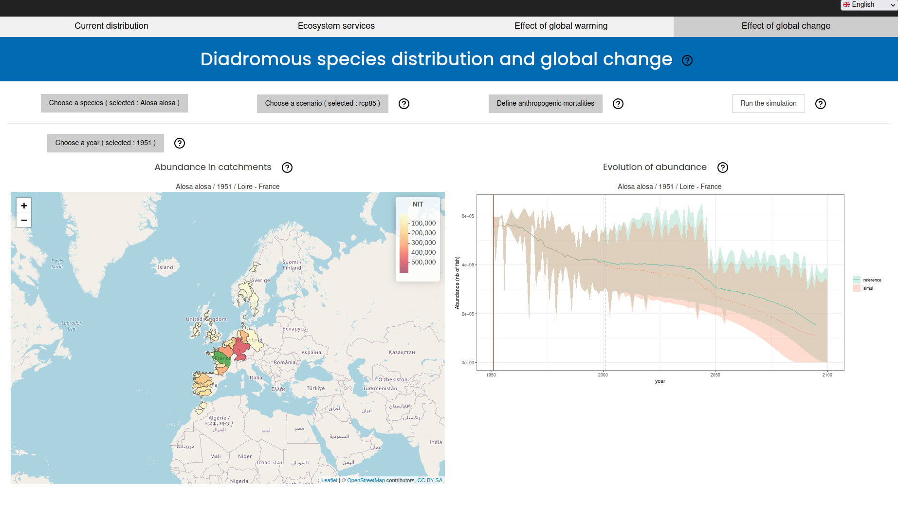
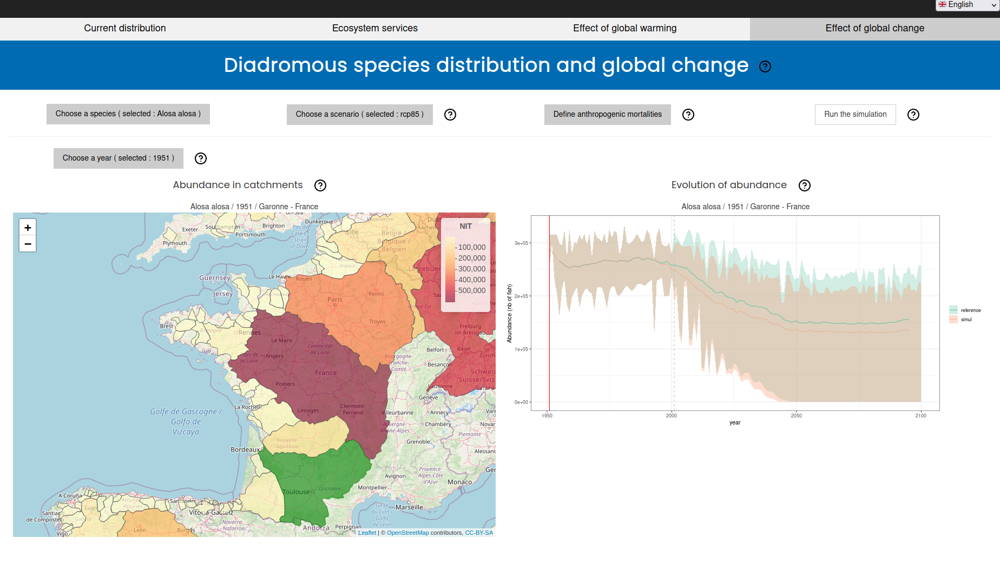

```{r setup, include=FALSE}
knitr::opts_chunk$set(echo = TRUE)
```

## Welcome on DiadES Atlas

This is the home page of the Shiny application.

-   To close the welcome message, click on the top right "X", or wherever out of the rectangle

```{r, echo=FALSE, out.width="75%"}

```

-   Select your language on the very top right menu of the application
-   Target the question mark (?) near the titles and boxes with your mouse to get more information about the different sections.

```{r, echo=FALSE, out.width="75%"}

```

## Current distribution

The first page of the application shows the current presence of a chosen species distribution.

-   Click on the "Choose a species" menu to select a specific species to show. The map updates directly.

-   Click on the "Change map resolution" to show the distribution along ICES rectangles instead of divisions

-   The conservation status on the right refers to the selected species

```{r, echo=FALSE, out.width="75%"}

```

-   The map is interactive and can be zoomed in or out

## Ecosystem services

This page is a synthesis of ecosystem services rendered by studied species.

The table is empty by default.
The user needs to choose among

-   one or multiple species in the list
-   one or multiple case studies by clicking on the polygons of the map
-   one or multiple ecosystem services in the list

... to show the valuations associated.

-   Click on "Show results" to let the table appear

```{r, echo=FALSE, out.width="75%"}

```

-   The display of the table can be changed with the button selector below the table to show species as rows or colums

```{r, echo=FALSE, out.width="75%"}

```

## Effect of global warming

This page is to explore the simulations under global warming effect.

-   The user can choose
    -   one of the species

    -   one of the global warming scnarios

    -   a specific year
-   Click on "Show results" to see the model outputs

```{r, echo=FALSE, out.width="75%"}

```

The outputs are:

-   On the left: A map of the catchment suitability index (NIT) for the selected year
-   On the right: the simulation outputs for all years until 2100. The vertical red line corresponds to the selected year and a specific study area, hence the results on the map.
-   The user can chose to show another study area by clicking on the map. The selected area is then green on the map, and the titles of the figures change.

```{r, echo=FALSE, out.width="75%"}

```

## Effect of global change

The users can create their own simulations by defining custom indices for "anthropogenic mortalities".

-   Choose one species
-   Choose one of the climatic scenarii
-   Define anthropogenic mortalities for both period and the chosen countries
    -   Double click on a cell to edit its value

    -   Click on top of the table to validate the value
-   Click on "Run the simulation"
    -   This take a few seconds

```{r, echo=FALSE, out.width="75%"}

```

All years and study areas have been simulated for the selexted species.

-   The user can choose a year to show the results on the map
-   The user can select a specific area by clicking on the polygon on the map
-   Titles of the outputs are modified according to user choice

```{r, echo=FALSE, out.width="75%"}

```

